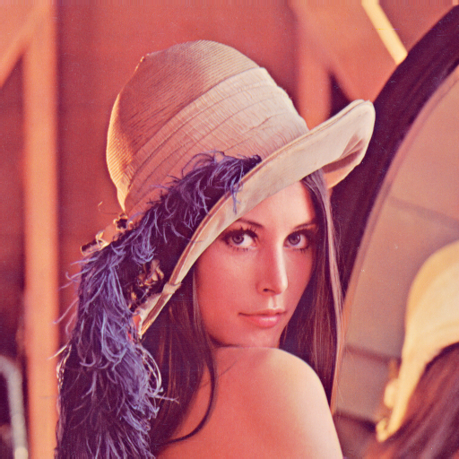
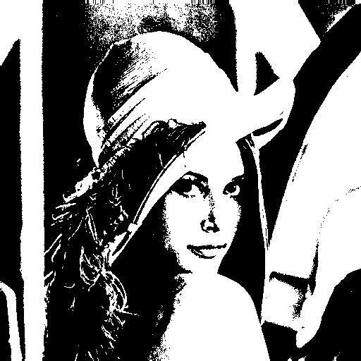

# 🧠 Projeto de IA: Binarização e Redução de Dimensionalidade da Imagem Lenna

Este projeto implementa a conversão de uma imagem colorida para tons de cinza e, em seguida, para preto e branco (binarização), **sem uso de bibliotecas externas**, exceto na etapa final de exportação para PNG com o Pillow.

O objetivo é aplicar uma **redução de dimensionalidade** da imagem:

- De RGB (3 canais de cor)
- Para tons de cinza (1 canal: 0 a 255)
- Para preto e branco (valores binários: 0 ou 255)


---

## 🚀 Etapas do Processo

### 1. Leitura do arquivo PPM binário (`P6`)
A imagem no formato `P6` é lida em modo binário, ignorando comentários, extraindo manualmente os valores RGB de cada pixel.

### 2. Conversão para escala de cinza
Cada pixel (R, G, B) é convertido para um único valor de intensidade com a fórmula de luminância: cinza = 0.299 * R + 0.587 * G + 0.114 * B


### 3. Binarização da imagem
Com um limiar fixo (threshold) de 128, os pixels são convertidos para:

- `0` (preto) se o valor for menor que 128
- `255` (branco) caso contrário

### 4. Salvamento em formato PGM (P2)
As imagens em cinza e binária são salvas em formato textual `.pgm`, que pode ser visualizado com GIMP ou convertido posteriormente para PNG.

---

## 🖼️ Resultados

### 🔷 Original (colorida)
<!-- Adicione a imagem aqui -->


### ⚪ Escala de cinza
<!-- Adicione a imagem aqui -->


### ⚫ Preto e branco (binarizada)
<!-- Adicione a imagem aqui -->


---

## 🧪 Dependência

Para instalar as dependências em um ambiente virtual:

```bash
python3 -m venv venv
source venv/bin/activate  # No Windows: venv\Scripts\activate
pip install -r requirements.txt